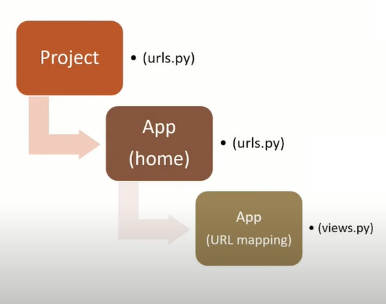

# COMMANDS
```python
python -m venv djvenv                           # creating the virtual environement before the project

djvenv\scripts\activate                         # Activating the virtual environement to use it

pip install django                              # Installing Django

django-admin startproject django_tutorial       # creating django project

python manage.py startapp home                  # creating an app (component)

python manage.py runserver                      # run server to a browser (routefolder -> Project Folder) 

http://127.0.0.1:8000/admin                     # Admin page (python project URL/admin). -> PF/urls.py

```

```python
python manage.py createsuperuser    # crate an admin user

```
```
username admin: admin
pass: adminadmin
```

# Django
Django's primary goal is to ease the creation of complex, database-driven websites.<br>

Django is Python framework, that enables rapid developement of secure and maintainable websites.
- Django follows the MVT designe pattern (Model View Template).
Django makes it easier to build better web apps more quickly and with less code.
It's free and open source.
Django framework is already have created the necessary things to create websites for example database, authentication system, admin panel.

**Check more about Django Documentation**

## Django Installation
1. Install **Python**
2. **Code editor** VS code / PyCharm. Install **Extensions : Python , Django**
        
3. Create a **Virtual Environement**
4. Install **Django**

create a project folder (project name)
Open that folder in the terminal ctrl+shift+ù, make sure the CD direcrory to the project folder

3rd stepp creating a virtual environement. It is not compolsury, but whenever you need to create a Python project its better to have. Benefits is Modules, django and all the rest will be installed here
```python

python -m venv djvenv       # djvenv is the folder name(any name), this command created the virtual environement.

djvenv\scripts\activate          # To use Virtual Environement we need to activate. here its backslash. Enter and you see activate with the folder name (djvenv) 
```
<br>

4th step Django installation
```python
pip install django      # successfull, go to the folder djvenv/lib/-> django <- module django
```
Django installation is completed !
<hr>

## Create Django Project & App
Django Project is the complete website, and the Apps are the components. The benefit of the component is that when we want to make changes to a website, we can take that specifique component just do the changes there it will not effect the whole website.

```python
                                ->APP       ->APP
                            ->APP       ->kart
DJANGO PROJECT (Amazon) ->APP       ->full home
                            ->APP       ->commentaries
                                ->APP       ->APP
```
Creating a Django project and APP
```python
django-admin startproject django_tutorial # django_tutorial(route folder is created and inside django project folder with the same name)

# Now we are going to create App inside that project, CD 
python manage.py startapp home # home is the appname, manage.py is a file inside the project folder
```
Run developement server, local host link to see what we have created
```python
# CD -> project folder (routefolder -> project folder) 
python manage.py runserver # to run server

When we look inside the route folder we can see the project folder, app folder, dbsqlite (database been created), and manage.py file
```
Link the App with the project (mydjangoporject folder and home app folder) 
```python
project folder / settings.py / INSTALLED_APPS[
    ...
    ...
    'home' # write app foldername, here it's the home
]
```
A Django settings file `(settings.py -> Read doc)` contains all the configuration of your Django installation. This document explains how settings work and which settings are available.
A settings file is just a Python module with module-level variables.
## M V T Model View Template

Data / Layout / Logic  =  seperation of concerns . In software engineering there different software design patterns. M V T is one of them.
The MVT is a software desigin pattern. Django follows the MVT design pattern.

**MODEL** : represts the data which is inside the database (table).
A Django model is a table in your database.
**VIEW** : Django views are Python functions that takes http requests and return http response.
Its function once client gives a request and how to process this request and how to process the request (information). Thats what we put inside the view. So the response in return for the client it all depends on this function. These part is called View.
**TEMPLATE** : A template in Django is basically a html file. Django framework efficiently handles and generates dynamically HTML web pages that are visible to the end-user.

With the help of this html file those response we get from the view function all it transfered to the template. THis html file to end-user is called template.

<br>
<br>
<br>
<br>
<br>

## URL Mapping and `VIEWS`
URL : Uniform Resource Locator is a unique identifier used to locate a resource on the internet.

Gets user requests by URL and responds back by map that route to call specified view function.
To handle URL, `django.url module` is used by the framework.  
Django has his own URL mapping and already have created the URL for admin `urls.py file` in the project folder. Where you define the mapping between URLs and views.

Going to Admin page `http://127.0.0.1:8000/admin`

<br>

<hr>

Forwarding `home/urls to project/urls`

<br>
Creation of URLs and views functions to Mapping.

```python
# Project -> urls.py
from django.contrib import admin
from django.urls import path , include # importing include

urlpatterns = [
    path('admin/', admin.site.urls), # admin/url, admin module, site class, urls method
    path('', include('home.urls')),  # '' root URL (website.com), include (),appname here its home
]
```
A **new file** creating in app folder `urls.py` (here its named home). Copied from urls.py from Project folder.

```python
# app(home) -> urls.py
from django.urls import path , include
from . import views     # . dot means current folder which is home(app) 

urlpatterns = [
    path('', views.index), # with which views function to connect
    path('about/', views.index),
    path('booking/', views.index),
    path('doctors', views.index),
    path('contact', views.index),
]
```
Inside app (home) `views.py` file. Creating an `index function etc`. These are some urls related to the project
```python
# app(home) -> views.py
from django.shortcuts import render

from django.http import HttpResponse # HttpResponse imported 

# Create your views here.
def index(request):
    return HttpResponse("Home Page")
def about(request):
    return HttpResponse("About Page")
def booking(request):
    return HttpResponse("Booking Page")
def doctors(request):
    return HttpResponse("Doctors Page")
def contact(request):
    return HttpResponse("Contact Page")
```
<hr>

## Templates

A template in Django is basically a html file. Django framework efficiently handles and generates dynamically HTML web pages that are visible to the end-user.

This template file and the help from view functions we can create dynamic webpages.

Create a template folder at the base folder where app(home), database. Here I have named mydjangoproject. `Create a index.html file with H1`
```html
<html>
    <head>
        <title>Home</title>
    </head>
    <body>
        <h1>Home Page</h1> 
    </body>
</html>
```

`file : app(home) -> views.py.` 
```python
# app(home) -> views.py
from django.shortcuts import render     # render()
from django.http import HttpResponse

# Create your views here.
def index(request):
    return render(request, 'index.html')  # here passing html file, return render()

def about(request):
    return HttpResponse("About Page")
def ....
    ....
```

Now we add this template folder with project settings. 

`Open project folder/settings.py`
```python
# project folder -> settings.py
TEMPLATES = [
    {
        'BACKEND': 'django.template.backends.django.DjangoTemplates',
        'DIRS': ['templates'], # added templates folder
```
Refresh the home page and you will find the h1 Home Page. Right click/ view source page, there you can see its the index.html rendered.

<br>

Now we create `more HTML files` like index.html at template folder `about,booking, contact, doctors` and a `new file department`. So for departement we made `path at app (home) -> urls.py`.

## Recap 1 start

`app (home) -> urls.py`
```python
#app (home) -> urls.py
from django.urls import path , include
from . import views     # . dot means current folder which is home(app) 
urlpatterns = [
    path('', views.index),      # with which views function to connect
    path('about/', views.about),
    path('booking/', views.booking),
    path('doctors/', views.doctors),
    path('contact/', views.contact),
    path('department/', views.department),
]
```
`app(home) -> views.py`
```python
# app(home) -> views.py
from django.shortcuts import render     # render()
from django.http import HttpResponse

# Create your views here.
def index(request):
    return render(request, 'index.html')  # here passing html file, render()

def about(request):
    return render(request, 'about.html')
def booking(request):
    return render(request, 'booking.html')
def doctors(request):
    return render(request, 'doctors.html')
def contact(request):
    return render(request, 'contact.html')
def department(request):
    return render(request, 'department.html')
```
`Project folder -> settings.py`
```python
# Project folder -> settings.py
INSTALLED_APPS = [
    'django.contrib.admin',
    'django.contrib.auth',
    'django.contrib.contenttypes',
    'django.contrib.sessions',
    'django.contrib.messages',
    'django.contrib.staticfiles',
    'home',  # home App
]

TEMPLATES = [
    {
        'BACKEND': 'django.template.backends.django.DjangoTemplates',
        'DIRS': ['templates'], # added templates folder
        'APP_DIRS': True,
        'OPTIONS': {
            'context_processors': [
                'django.template.context_processors.debug',
                'django.template.context_processors.request',
                'django.contrib.auth.context_processors.auth',
                'django.contrib.messages.context_processors.messages',
            ],
        },
    },
]
```
`Project folder -> urls.py`
```python
# Project folder -> urls.py
....
from django.contrib import admin
from django.urls import path , include      # importing include

urlpatterns = [
    path('admin/', admin.site.urls),        # admin/url, admin module, site class, urls method
    path('', include('home.urls')),         # '' root URL (website.com), include (),appname here its home
]
```
`6 html files like mentioned`
```html
<html>
    <head>
        <title>Home</title>
    </head>
    <body>
        <h1>Home Page</h1> 
    </body>
</html>
```
## End of recap <hr>

## Django Templates : `VARIABLES & TAGS`
**VARIABLES** : 
- A template conatains variables, which get replaced with values when the template is evaluated.
- We can render variables by putting them inside `{{ }}` brackets :

**TAGS** : 
- A tag, which control the logic of the template.
- If Else & Loop
- To execute template tags, putting them inside ``

**-> VARIABLES :**          **`{{ }}`**

`app(home) -> views.py`
```python
from django.shortcuts import render     # render()
from django.http import HttpResponse

# Create your views here.
def index(request):

    person = {
        'name' : 'John',
        'age' : 30,
        'place' : "Strasbourg"
    }
    return render(request, 'index.html', person)  # here passing html file, render(), person dictionary as argument to index.html 


def about(request):
    return render(request, 'about.html')
```

`project folder/ template -> index.html`
```html
<html>
    <head>
        <title>Home</title>
    </head>
    <body>
        <h1>Home Page</h1> 

        <h2>Name is {{ name }}</h2>
        <h2>Age is {{ age }}</h2>
        <h2>Place is {{ place }}</h2>
    </body>
</html>
```
Dynamic Template

<br>

**-> TAGS :**       **`         `**
-  must have 

`app(home) -> views.py`
```python
from django.shortcuts import render     # render()
from django.http import HttpResponse

# Create your views here.
def index(request):

    numbers = {
        'num1' : -10,
    }
    return render(request, 'index.html', numbers)
```
Giving conditional statements in html file, at template

`project folder/ template -> index.html`
```html
<html>
    <head>
        <title>Home</title>
    </head>
    <body>
        <h1>Home Page</h1> 
        
            <h2>Positive Number</h2>
        
            <h2>Negative Number</h2>
        
            <h2>Number is Zero</h2>
        
    </body>
</html>
```

<br>

## Django Templates : `FOR`         **`     `**
-  must have 

`app(home) -> views.py`
```python
from django.shortcuts import render     # render()
from django.http import HttpResponse

# Create your views here.
def index(request):
    numbers = {
        'num1' : [1,2,3,4,5,6,7,8,9,10]
    }


    # second loop list
    def index(request):
    numbers = {
        'fruits' : ['banana', 'apple', 'grapes']
    }
    return render(request, 'index.html', numbers)
```
```html
<html>
    <head>
        <title>Home</title>
    </head>
    <body>
        <h1>Home Page</h1>

        
            <h2> {{ n }}
        
    </body>
</html>


<html>
    <head>
        <title>Home</title>
    </head>
    <body>
        <h1>Home Page</h1>

         
            <h2> {{ f }}
        
    </body>
</html>
```
1)
2)<br>

## ``TEMPLATE INHERITANCE``
Template inheritance allows you to build a base "skeleton" template that contains all the common elements of your site and defines blocks that child templates can override.<br>
Templates help when you want to use the same information or layout in more than one place. And if you want to change something, you don't have to do it in every template, just one!

**Inheritance : ``**

**Blocks : ` `**

A `new base.html file` created inside the folder template. And this file is going to  pass through other files and the changes here we make at each title of html files and their contents.
```html
<html>
    <head>
        <meta charset="utf-8">
        <meta http-equiv="X-UA-Compatible" content="IE=edge">

        <title> </title>     <!-- block allow to change any HTML file content, so the changes where made it inherits -->

        <meta name="description" content="">
        <meta name="viewport" content="width=device-width, initial-scale=1">
        <link rel="stylesheet" href="">
    </head>
    <body>
        <h1 style="color:red;">Hello from Base HTML</h1>        <!-- base content will continue to show up once anyfile extends the base file -->
                               <!-- same here -->

        <script src="" async defer></script>
    </body>
</html>
```
`index.html` contains this information only with no html tags but extends `base.html`
```python



Home                    # title name, here now child template can override



<h1>Home Page</h1>      # contents inside the body

```
Home title and Home page h1 coming from index.html and the Red hello message is the base.html h1.

<br>

<hr>

# PROJECT

**`base.html`   ->**  bootstrap, block title and block content (from other html files)
```html
<!DOCTYPE html>
<html>

  <head>
    <meta charset="UTF-8">
    <title> </title> 

    <meta charset="utf-8">
    <meta name="viewport"
      content="width=device-width, initial-scale=1, shrink-to-fit=no">
    <meta name="description" content="">
    <meta name="author" content="">
    <link rel="stylesheet"
      href=" https://cdn.jsdelivr.net/npm/bootstrap@5.1.3/dist/css/bootstrap.min.css ">
    <link rel="stylesheet"
      href="https://use.fontawesome.com/releases/v5.2.0/css/all.css">
  </head>

  <body>
    
    <nav class="navbar bg-primary navbar-expand-md ">
      <div class="container">
        <div class="col-2 text-left pl-md-0">
          <h3 class="text-white"> City Hospital </h3>
        </div>
        
        <div
          class="collapse navbar-collapse justify-content-center col-md-8 navbar-collapse-3">
          <ul class="navbar-nav justify-content-center  fw-bold">
            <li class="nav-item active">
              <a class="nav-link text-white" href="#">Home </a>
            </li>
            <li class="nav-item">
              <a class="nav-link text-white" href="#">About</a>
            </li>
            <li class="nav-item">
              <a class="nav-link text-white" href="#">Booking</a>
            </li>
            <li class="nav-item">
              <a class="nav-link text-white" href="#">Doctors</a>
            </li>
			 <li class="nav-item">
              <a class="nav-link text-white" href="#">Departments</a>
            </li>
            <li class="nav-item">
              <a class="nav-link text-white" href="#">Contact Us</a>
            </li>
          </ul>
        </div>
        
      </div>
    </nav>

     

    <section class="fixed-bottom">
      <footer class="pt-2 pb-2  bg-primary text-light">
        <div class="container">
          <div class="row align-items-center">
            <div class="col-12 col-md-8">
              <h4>Emergency Contact Number: 0123456789</h4>
            </div>
            <div class="col-12 col-md-4 mt-4 mt-md-0 text-center text-md-end">
              © 2022 City Hospital. All Rights Reserved
            </div>
          </div>
        </div>
      </footer>
    </section>

    <script
      src="https://cdn.jsdelivr.net/npm/bootstrap@5.1.3/dist/js/bootstrap.bundle.min.js"
      integrity="sha384-ka7Sk0Gln4gmtz2MlQnikT1wXgYsOg+OMhuP+IlRH9sENBO0LRn5q+8nbTov4+1p"
      crossorigin="anonymous"></script>

  </body>
</html>
```
**`index.html`   ->**  All other template files extends `base.html` with other texts inside block title and block content
```python
    

    
    Home
    

    
    <h1>Home Page</h1>
    
```
<br>

## Link Navbar
We will make the navbar work with all the template files that we have already adapted, such as the one above index.html.

`APP(home) -> urls.py`
```python
from django.urls import path , include
from . import views      
urlpatterns = [
    path('', views.index, name='home'),         # we add one more argument name with the path. name = ' This name gives access to the links '
    path('about/', views.about, name='about'),
    path('booking/', views.booking, name='booking'),
    path('doctors/', views.doctors, name='doctors'),
    path('contact/', views.contact, name='contact'),
    path('department/', views.department, name='department'),
]
```
**href="**

`APP(home)/ templates-> base.html`
```html
    <li class="nav-item active">
        <a class="nav-link text-white" href="">Home </a>  
    </li>
    <li class="nav-item">
        <a class="nav-link text-white" href="">About</a>
    </li>
    ....
    ....
```

## Django ADMIN INTERFACE
The administrative interface, or admin for short, allows trusted site administrators to create, edit and publish content, manage site users, and perform other administrative tasks. 

When we create a Django project, Django provides an Admin Interface to manage our Website. With the help of Admin Interface we can access to the table inside our database, so its possible to data delete or update.

Django provides a ready-to-use user interface for administrative activities. It reads metadata from your models to provide a quick, model-centric interface where trusted users can manage content on your site.

`http://127.0.0.1:8000/admin`

<br>

**`How to use Admin Interface and how to login`**

First we must create a **SUPER USER** to loging

Create an admin user : 

If server is running  `ctrl+c` to stop server temperarly 

```python
python manage.py createsuperuser    # crate an admin user

# ERROR : 
        # You have 18 unapplied migration(s). Your project may not work properly until you apply the migrations for app(s): admin, auth, contenttypes, sessions.        
        # Run 'python manage.py migrate' to apply them.

python manage.py makemigrations   # No changes detected

# All of the migrations pending will be done with the following command
Pyrhon manage.py migrate            #Operations to perform:
                                    # Apply all migrations: admin, auth, contenttypes, sessions
                                    # Running migrations:
                                    # Applying contenttypes.0001_initial... OK
                                    # Applying auth.0001_initial... OK
                                    # Applying admin.0001_initial... OK
                                    # Applying admin.0002_logentry_remove_auto_add... OK
                                    # Applying admin.0003_logentry_add_action_flag_choices... OK
                                    # Applying contenttypes.0002_remove_content_type_name... OK
                                    # Applying auth.0002_alter_permission_name_max_length... OK
                                    # Applying auth.0003_alter_user_email_max_length... OK
                                    # Applying auth.0004_alter_user_username_opts... OK
                                    # Applying auth.0005_alter_user_last_login_null... OK
                                    # Applying auth.0006_require_contenttypes_0002... OK
                                    # Applying auth.0007_alter_validators_add_error_messages... OK
                                    # Applying auth.0008_alter_user_username_max_length... OK
                                    # Applying auth.0009_alter_user_last_name_max_length... OK
                                    # Applying auth.0010_alter_group_name_max_length... OK
                                    # Applying auth.0011_update_proxy_permissions... OK
                                    # Applying auth.0012_alter_user_first_name_max_length... OK
                                    # Applying sessions.0001_initial... OK

python manage.py createsuperuser    
    "Username (leave blank to use 'fab'):" admin        # These strings are the questions to create super user
    "Email address:" fabinriza1@yahoo.co.in
    "Password:" adminadmin
    "Password (again):" adminadmin
    # Superuser created successfully !
```
Once the Super User is created run the server again `python manage.py runserver`. Go to the admin page and give the one you have given, here it is `username : admin | password : adminadmin`. 

<br>

Here we can create Groups or add Users.
Adding a new User : 
```python
Click "add" at Users
"Username" : reception
"password" : test@123

Active ✅
Staff status ✅  # login access
Superuser status # every access like superuser
```
<br>

Sign in as admin and deleting the User (reception) which we have created

<br>

## `STATIC FILES`
Aside from the HTML generated by the server, web applications generally need to serve `additional files -- such as images, Javascript, or CSS --` necessary to render the complete web page. In Django, we refer to these files as " STATIC FILES ".

We are going to add some (files/ css etc) folders inside the project folder (root folder/ basfolder) where we have created already the app folder and template.

`Static files`
Folder name : static,  inside that add 3 sub folders named them css (add a style.css file inside), js and images.

`Adding static files` then only our project can serve the static files.

**`Project folder -> settings.py`**  **check the django documentation for further ...** 
```python
import os                       # F for the static files


STATIC_URL = 'static/'
STATICFILES_DIRS = [                    # F for the static files, now our project knows that there is static folder inside root directory
    os.path.join(BASE_DIR,'static')
]
```
**`Static folder/css -> style.css`** Some hoover effect for the navbar
```css
li:hover{
    background-color: gray;
    border-radius: 10px;
    border:solid 1px yellow ;
}
```
**`Template folder -> base.html`**
```py
 # Loading static here for (css)

<!DOCTYPE html>
<html>
    <head>
        ...
        ...
        <link rel="stylesheet"
            href=""> # liniking css file   
    </head>
```

<br>

## How to **`serve Image files`** 

Pick images (I took three images for now) and pasted inside `static folder->images` or right click and `reveal in file explorer to copy`

Our project already knows where the static folders are place and it will find the images through there. Like we have mentioned just above with static files.

`DONT COPY THIS JUST A RECAP`
```python
# `DONT COPY THIS, JUST A RECAP`
# WE HAVE ALREADY BROUGHT STATIC FOLDER HERE WHERE THE PROJECT WILL FIND THE IMAGES FOLDER ASWELL

import os                       # F for the static files


STATIC_URL = 'static/'
STATICFILES_DIRS = [                    # F for the static files, now our project knows that there is static folder inside root directory
    os.path.join(BASE_DIR,'static')
]
```
Bootstrap **`slideshow of three images`** just for the index page.

**`Template folder -> index.html`**
```html




Home





              <!-- Here static been loaded  (comment bad format) -->

<div id="carouselExampleDark" class="carousel carousel-dark slide" data-bs-ride="carousel">
    <div class="carousel-indicators">
      <button type="button" data-bs-target="#carouselExampleDark" data-bs-slide-to="0" class="active" aria-current="true" aria-label="Slide 1"></button>
      <button type="button" data-bs-target="#carouselExampleDark" data-bs-slide-to="1" aria-label="Slide 2"></button>
      <button type="button" data-bs-target="#carouselExampleDark" data-bs-slide-to="2" aria-label="Slide 3"></button>
    </div>
    <div class="carousel-inner">
      <div class="carousel-item active" data-bs-interval="10000">
           <!-- {# bringing images from static folder#}      (comment bad format)-->
      </div>
      <div class="carousel-item" data-bs-interval="2000">
        
        
      </div>
      <div class="carousel-item">
        
        
      </div>
    </div>
    <button class="carousel-control-prev" type="button" data-bs-target="#carouselExampleDark" data-bs-slide="prev">
      <span class="carousel-control-prev-icon" aria-hidden="true"></span>
      <span class="visually-hidden">Previous</span>
    </button>
    <button class="carousel-control-next" type="button" data-bs-target="#carouselExampleDark" data-bs-slide="next">
      <span class="carousel-control-next-icon" aria-hidden="true"></span>
      <span class="visually-hidden">Next</span>
    </button>
  </div>


```
Static 3 image slides @ home/ index.html

<br>

<hr>

## `DJANGO MODELS`

Django model is a class that represents table in our Database.Django create a database when we create the project.Models are defined in the `app(home folder)-> models.py`. Which is empty, only importing models.

A model is the single, definitive source of information about your data. It contains the essential fields and behaviours of the data you're storing. Generally, each model maps to a single database table.
- Each model is a PYTHON CLASS that subclasses `django.db.models.Model` .
- Each attribute of the model represents a database field.
- With all of this, Django gives you can automatically-generated databas-access API

**Read django documentation MODEL**

```python
from django.db import models

# Create your models here.
```

In this project we will have 3 tabels and fields
```
                               
                    -> dep_name
DEPARTMENT  ->  ->
                    ->dep_description


                        ->doc_name      
                    ->doc_spec       
DOCTORS     ->  ->
                    ->dep_name      
                        ->doc_image     

                            ->p_name 
                        ->p_phone   
                    ->p_email  
BOOKING     ->  ->
                    ->dep_name 
                        ->doc_name       
                            ->booking_date
```
Django by default give each model an auto-incrementing primary key, id.

**`App folder -> models.py`**
```python
from django.db import models

# Create your models here.

class departments(models.Model):                    # departments is our model name (base class ) departments is inheriting from the base class
    dep_name = models.CharField(max_length=100)     # dep_name is selecting the field, charector field max to 250 but given limitation here
    dep_description = models.TextField()            # textfield more than 255 charectors
```
IMPORTANT : Whenever we create a model, updated or whenever doing any thing related with model we have to MIGRATE so then only it will effect at database. 

Save the file and stop server to run the migration command

```python
python manage.py makemigrations     # first migration for the departements been detected, this command will list how many are there to migrate
                                        # O/P : in terminal :  
                                        # Migrations for 'home':
                                        #   home\migrations\0001_initial.py
                                        #     - Create model departments

python manage.py migrate            # migrate will create table in our database 
                                        # O/P : in terminal :  
                                        # Operations to perform:
                                        #   Apply all migrations: admin, auth, contenttypes, home, sessions
                                        # Running migrations:
                                        #   Applying home.0001_initial... OK
```
Migration seen in the terminal

<br>

To see what happend, **just to see what these commands done behind** `(1) Django done in the backend`. We dont do anything here but we can see `(2) Django created the id, primary key`.

**`App folder/migrations -> 0001_initial.py`**
```python
# Generated by Django 4.1.2 on 2022-10-20 13:28                     # id and primary key auto generated

from django.db import migrations, models


class Migration(migrations.Migration):

    initial = True

    dependencies = [
    ]

    operations = [
        migrations.CreateModel(
            name='departments',
            fields=[
                ('id', models.BigAutoField(auto_created=True, primary_key=True, serialize=False, verbose_name='ID')),
                ('dep_name', models.CharField(max_length=100)),
                ('dep_description', models.TextField()),
            ],
        ),
    ]
```
Once we go back and connect as admin `we dont see any output (department)` there yet. Which means what we have created the departments.

<br>

We have to make it visible the department, to do that must register the model. Imort and register
**`App folder -> admin.py`**
```python
from django.contrib import admin

from .models import Departments  # .model here its  current folder, Departments is the model we have created 

# Register your models here.
admin.site.register(Departments)    # registering the (Departments)
```
<br>

Create one department - one is created. Here will see the two fields which we have created dep_name and dep_description.

<br>

Bring descriptions to template, the contents from the database (department) to our website. This is one of the operations from CRUD, in this case it's READ.

A div element will be styled for the department : the name, department.html. 

Disable Django extension to write fast html (not necessary, we can reload later), close vscode and activate virtual environment `djvenv\scripts\activate`  and run server.


Some bootstrap added at `template -> department.html`

we are going to pull the data from our database, go to  `app -> views.py` import the department form models.py. 

Will create a dictionary inside the department function view.py

`app -> model.py` This code is given here to remind the field name we have given.
```python
from django.db import models  

class Departments(models.Model):    #  Departments
    dep_name = models.CharField(max_length=100) #  dep_name
    dep_description = models.TextField()
```
`app -> views.py`
```python
from django.shortcuts import render     
from django.http import HttpResponse

from .models import Departments # models.py department we have created

def index(request):
    return render(request, 'index.html')  

def about(request):
    return render(request, 'about.html')
def booking(request):
    return render(request, 'booking.html')
def doctors(request):
    return render(request, 'doctors.html')
def contact(request):
    return render(request, 'contact.html')

def department(request):
    dict_dept = {
        'dept' : Departments.objects.all()  # pulling department-all fields
    }
    return render(request, 'department.html', dict_dept)  # passing the dictionary to html 'dict_dept'

```
```python



Department



<h1 class="text-center"> Our Departments </h1>
<hr>

                     # {# dept is the dictionary form views.py #}
<div class="mx-auto w-50 bg-success text-center text-white p-3 my-5 border border-warning rounded" >  # bootstrap div
    <h1>{{d.dep_name}}</h1>
    <p>{{d.dep_description}}</p>
</div>


```

`READ database values` O/P : Departments

<br>

Then we `add 4 more department` with the admin panel and all is visibile at our department.

<br>

<br>

## Models 2
Going to create doctors model
```
                        ->doc_name      
                    ->doc_spec       
DOCTORS     ->  ->
                    ->dep_name      
                        ->doc_image  
```
home(app)-> models.py
```py
class Doctors(models.Model):
    doc_name = models.CharField(max_length=255)
    doc_spec = models.CharField(max_length=255)
    dep_name = models.ForeignKey(Departments, on_delete=models.CASCADE) # ForeignKey, If we delete from department records here will be deleted as well
    doc_image = models.ImageField(upload_to="doctors")
```
<br>

Above we used `imageField so we need to install the library Pillow` stop the server and install Pillow `python -m pip install Pillow` 

There are 2 settings for Pillow library to be done.

project folder-> settings.py
```py
MEDIA_ROOT = BASE_DIR / "uploads"   # F BASE_DIR is where file manage.py folder
MEDIA_URL = '/media/'   # to serve photo as static file
```
project folder-> urls.py
```py
from django.conf import settings #
from django.contrib import admin
from django.urls import path , include      
from django.conf.urls.static import static #

urlpatterns = [
    path('admin/', admin.site.urls),        
    path('', include('home.urls')),       
]        + static(settings.MEDIA_URL, document_root=settings.MEDIA_ROOT)  # F for images
```
then we migrate doctors `python mangage.py makemigrations` 

<br>


and migrate `python mangage.py migrate`

<br>

register Doctors now in the file admin.py

App folder-> admin.py
```py
from django.contrib import admin
from .models import Departments, Doctors # we register Doctors

# Register your models here.
admin.site.register(Departments)    
admin.site.register(Doctors)        # registering the doctors and this model(table) will be available in admin panel
```
Run the server and check at admin panel for Doctors, and click add doctors.

Here you will find the Dep_name as object

<br>

This __str__() function is to show department name at the place of object which is shown inside admin when you will add doctors details.

app folder-> models.py
```py
from django.db import models

# Create your models here.

class Departments(models.Model):
    dep_name = models.CharField(max_length=100) 
    dep_description = models.TextField()
    
    def __str__(self):                  # so this function to show the dep_name at admin doctrors
        return self.dep_name

class Doctors(models.Model):
    doc_name = models.CharField(max_length=255)
    doc_spec = models.CharField(max_length=255)
    dep_name = models.ForeignKey(Departments, on_delete=models.CASCADE) # ForeignKey was the reason
    doc_image = models.ImageField(upload_to="doctors")
```

The __str__() method corrected the department name

<br>

148